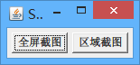
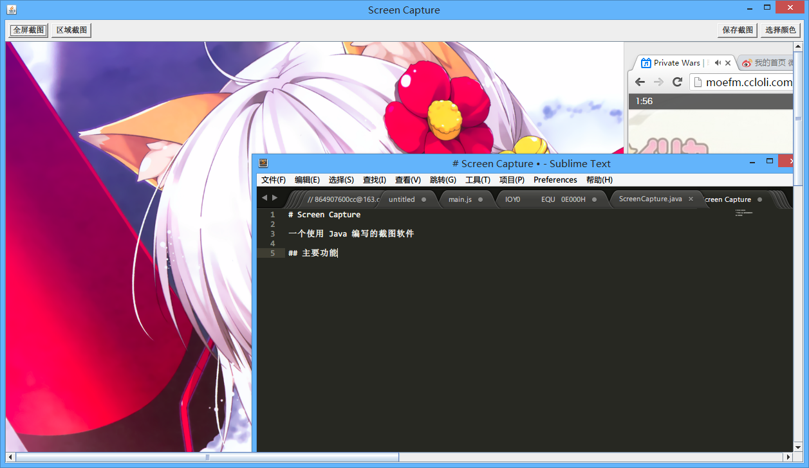
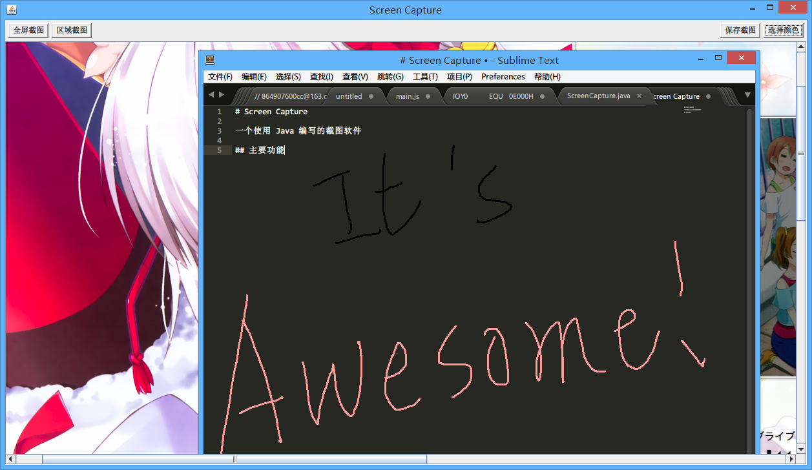
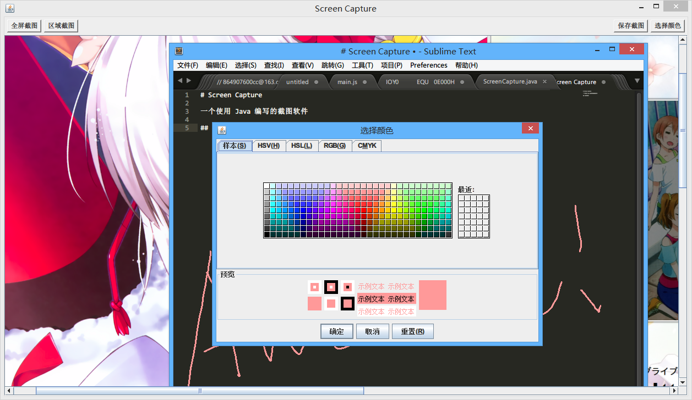
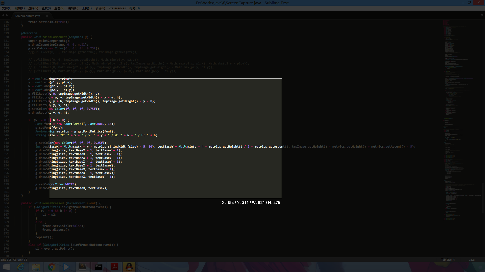
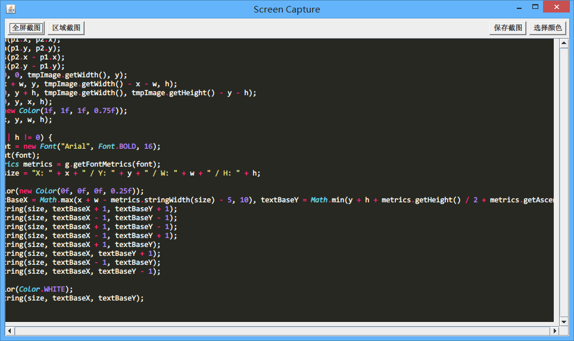
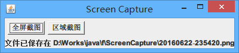
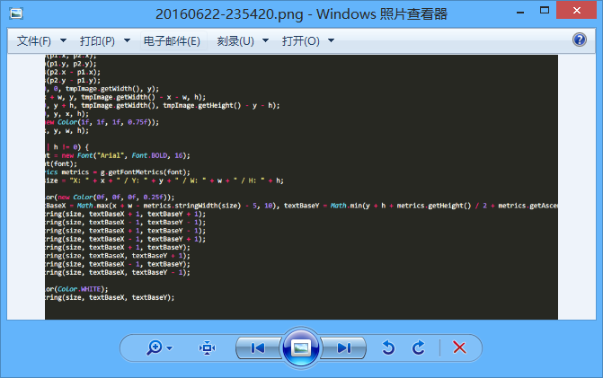
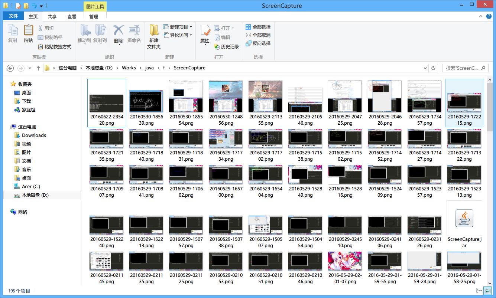

# Screen Capture

一个使用 Java 编写的截图软件，支持全屏截图、区域截图，并支持涂鸦与跨屏幕截取功能。



## 功能介绍

### 全屏截图

单击程序的“全屏截图”按钮，即可截取屏幕。由于代码对多屏幕进行了兼容，所以如果用户拥有两个或以上的屏幕，将会截取所有的屏幕图像，并按照各个屏幕在系统中的位置对图像进行拼合。



### 涂鸦

图像截取后不会马上保存，而是在程序窗口内展现已截取的图片供用户进行涂鸦。当用户使用鼠标在图片上拖动时，会在图片上绘制线条。



### 选择画笔颜色

单击窗口右上角的“选择颜色”按钮将显示取色框，用户可以自由选择涂鸦的画笔颜色。



### 区域截图

单击窗口的“区域截图”按钮，会立即截取所有屏幕的当前图像，并使整个屏幕变得暗淡。用户可以使用鼠标左键在屏幕上拖拽，拖拽时会显示选区的当前参数。


_（这张图片展示的截取区域其实正好是高亮选区与显示选区参数的功能代码）_

用户选定区域后，需要通过双击左键完成截取。如果用户对选取不满意，可直接重新选取，或单击鼠标右键退出区域截图。



### 保存截图

单击窗口右上角的“保存截图”按钮，会将画布上展示的截图保存，并显示提示文字。



用户可以点击保存成功的提示文字立即打开文件。



图片截取后会保存在程序运行目录下的 `ScreenCapture` 文件夹，文件名格式为 `yyyyMMdd-HHmmss.png` (`年月日-时分秒.png`)。



## 源代码说明

_为了简化本文档，各类与接口内的属性均不会被介绍，而且它们对理解程序的影响并不大_

### `class ScreenCapture`

程序的入口类，为整个程序的主体部分。其实例化的方法如下：

- `void main()`
  实例化该类。

- `ScreenCapture()`
  入口函数，初始化整个程序的界面以及相关的控件与事件。

- `void captureImage()`
  截取所有屏幕的图像并进行拼合，并存储到 `BufferedImage tmpImage` 中。

- `void clipImage()`
  请求对全屏截图进行选取以进行区域截图，并实例化一个监听回调函数响应区域选取事件，响应后调用 `editImage()` 方法。

- `void editImage()`
  对截取的图像进行编辑，将其实例化为一个 `CaptureCanvas` 类以及基于该实例化类的颜色选择按钮，然后将它们显示在程序上并按需调整程序窗口大小。

- `void saveImage()`
  保存截取的图像，将其保存为 `./ScreenCapture/yyyyMMdd-HHmmss.png`，然后显示提示信息，并自动清除提示信息。

- `void actionPerformed(ActionEvent event)`
  响应窗口内触发的事件。若为全屏截图则依次调用 `captureImage()` 和 `editImage()` 方法；若为区域截图则依次调用 `captureImage()` 和 `clipImage()` 方法；若为保存截图则移除程序窗口内相关的控件并调用 `saveImage()` 方法；

### `interface ImageClipedEventListener`

选取图片区域完成的事件监听接口。包含一个 `void implementClipArea()` 方法，用于注册事件监听器的响应方法。

### `class ImageClipedEventResponder`

基于选取图片区域完成的事件监听接口生成的抽象类。包含一个覆盖的 `void implementClipArea(Rectangle r)` 方法，用于注册事件监听器的响应方法，其传入的参数为选取的图像区域对象。

### `class ImageClipedEvent`

自定义的一个选取图片区域的事件。其实例化的方法如下：

- `void addListener(ImageClipedEventListener el)`
  为实例化的该类定义事件监听器。其接受一个传入参数 `ImageClipedEventListener el` 用于传入事件监听器。

- `void implement(Rectangle r)`
  向事件监听器传入选取的区域信息。其接受一个传入参数 `Rectangle r` 用于传入选取的区域对象。

### `class CaptureCanvas`

预览图像的画布类。由于 StackOverflow 上有回答说 `Canvas` 类实在是太老了，所以这里是按照文中建议的基于 `JPanel` 进行扩展。其实例化的方法如下：

- `CaptureCanvas(BufferedImage _tmpimage)`
  入口函数，初始化 `CaptureCanvas` 的一些基本信息。其接受一个传入参数 `BufferedImage _tmpimage` 用于接收全屏截取的图像，并将其存储到私有变量 `BufferedImage tmpImage` 内，以绘制到画布中。

- `Button createColorPickBtn()`
  为实例化的 `CaptureCanvas` 类创建一个颜色选取按钮。它将会被显示在程序的右上角，当用户选取颜色后它会将颜色值保存到该实例化类的私有变量 `Color color` 中。

- `void paintComponent(Graphics g)`
  覆盖 `JPanel` 类的 `paintComponent()` 方法，其会在每次要求重绘时将 `BufferedImage tmpImage` 显示在画布上，以实时显示绘制的结果。

- `void mousePressed (MouseEvent event)`
  覆盖 `MouseListener` 的 `mousePressed()` 方法，其会记录用户点击时鼠标的坐标并存储到 `Point p1` 中。

- `void mouseDragged (MouseEvent event)`
  覆盖 `MouseListener` 的 `mouseDragged()` 方法，其会记录用户拖拽时鼠标的坐标并存储到 `Point p2` 中。然后获取 `BufferedImage tmpImage` 的画布，将 `Point p1` 与 `Point p2` 的坐标间进行连线。最后更新 `Point p1` 并请求重绘 `CaptureCanvas`，以实时显示绘制的结果。

### `class SelectImageArea`

选取图像区域的类。其实例化的方法如下：

- `SelectImageArea(BufferedImage _tmpimage, ImageClipedEventResponder el)`
  入口函数，初始化 `SelectImageArea` 的一些基本信息（如窗口大小与事件等，并显示选取窗口）。其接受两个传入参数：`BufferedImage _tmpimage` 用于接收全屏截取的图像，并将其存储到私有变量 `BufferedImage paintComponent` 内；`ImageClipedEventResponder el` 为传入的事件监听器类，用于当用户选取区域后传回该区域的相关数据。

- `void paintComponent(Graphics g)`
  覆盖 `JPanel` 类的 `paintComponent()` 方法，其会在每次要求重绘时将 `BufferedImage tmpImage` 显示在画布上，并高亮显示用户拖拽的选区以及该选区的相关信息。

- `void mousePressed (MouseEvent event)`
  覆盖 `MouseListener` 的 `mousePressed()` 方法。如果点击的是左键，则其会记录用户点击时鼠标的坐标并存储到 `Point p1` 中；如果点击的是右键且已经选取了选区，则会清除选区信息，否则隐藏并销毁选区窗口。

- `void mouseDragged (MouseEvent event)`
  覆盖 `MouseListener` 的 `mouseDragged()` 方法，其会记录用户拖拽时鼠标的坐标并存储到 `Point p2` 中并请求重绘 `SelectImageArea`，以实时显示选区信息。

- `void mouseClicked(MouseEvent event)`
  覆盖 `MouseListener` 的 `mouseClicked()` 方法，若用户进行了双击且选区信息有效则会向事件监听器 `ImageClipedEventResponder el` 传入区域对象进行回调，并隐藏及销毁选区窗口。

## 已编译文件

参见 `./dist/ScreenCapture.jar`。

## 自行编译

程序的源代码存放在 `./src/ScreenCapture.java`，若需要编译并打包为 jar 文件可在 Windows 下直接运行 `./src/ScreenCapture.bat`，或执行以下操作：

```sh
cd ./src
javac -encoding utf8 ScreenCapture.java
jar cfe ScreenCapture.jar ScreenCapture *.class
```

## 碎碎念

其实这个程序的核心功能是通宵完成的，应该是 5 月 28 日的 23:30 到 29 日的 06:30。虽然熬夜完成确实有些许的不适，不过在完成时还是非常喜悦的。之后在当天又花了一个下午把整个程序的附加功能完成了，最后又花了些零散的时间完善了下一些细节。能在短短的十二小时内完成这个程序，自然离不开 Java Docs 上详细的介绍，更离不开 StackOverflow 上各位大神精辟的回答。虽然在刚开始编写时走了许多弯路（事实证明通宵写代码容易智商下降 _(:3），但是最终还是借助网络找到了更好的实现方法。

## 许可协议

GPLv3 or MIT